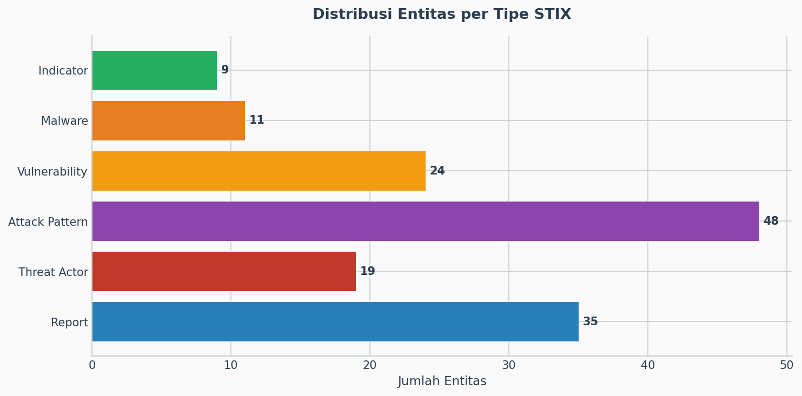
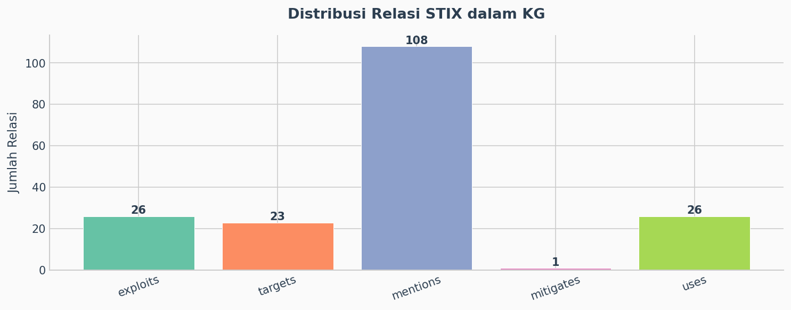
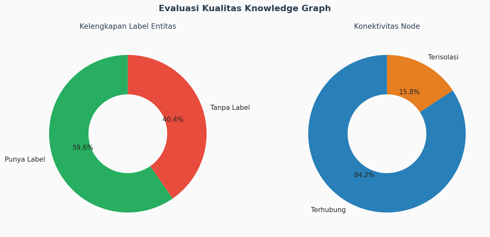
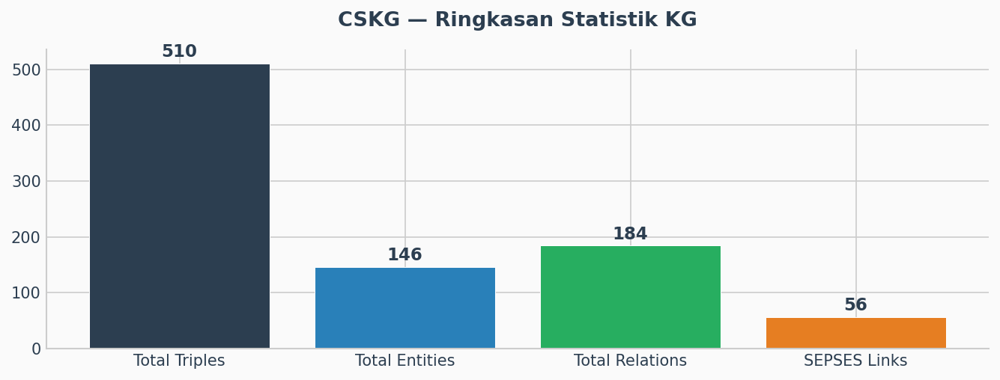
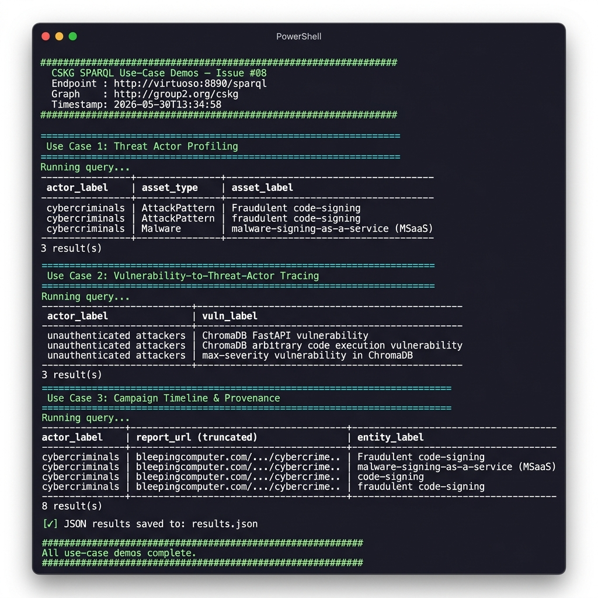

# Constructing a Cybersecurity Knowledge Graph (CSKG) from Unstructured Data

This project is a fork of an existing implementation of an automated data pipeline to construct a Cybersecurity Knowledge Graph (CSKG) from unstructured data sources like security blogs and attack reports. It is made as a final project for MRPL (Metode Rekayasa Perangkat Lunak) class.

## 0. Our Team Members

We are Group 6 which includes these amazing guys:
| Name     | NIM | Username |
| ---      | ---       | --- |
| Dhimas Early Oceandy (PIC) | 24/533508/PA/22584 | EarlyOcean |
| Anders Emmanuel Tan     | 24/541351/PA/22964 | Plumz17 | 
| Azhar Maulana | 24/533487/PA/22582 | naa2412 |
| Evan Razzan Adytaputra | 24/545257/PA/23166| evanrazzanadytaputra2006-dotcom | 

## 1. Data Sources
We used 6 sources in total: 1 from the original implementation and 5 added by this group.

### 1. TheHackerNews (RSS)
- Access: `http://feeds.feedburner.com/TheHackersNews`
- Purpose: Broad cybersecurity news covering APTs, malware, and CVEs.

### 2. BleepingComputer (RSS)
- Access: `https://www.bleepingcomputer.com/feed/`
- Purpose: Incident-level reporting with rich IOC details such as domains, hashes, and file names.

### 3. KrebsOnSecurity (RSS)
- Access: `https://krebsonsecurity.com/feed/`
- Purpose: Investigative journalism focused on cybercrime and threat actors.

### 4. FortiGuard Labs (RSS)
- Access: `https://filestore.fortinet.com/fortiguard/rss/outbreakalert.xml`
- Purpose: Structured outbreak alerts with technical indicators and severity information.

### 5. NVD CVE API (REST)
- Access: `GET https://services.nvd.nist.gov/rest/json/cves/2.0`
- Purpose: NIST's authoritative CVE repository.

### 6. CIRCL CVE Feed (REST)
- Access: `GET https://cve.circl.lu/api/last/N`
- Purpose: Real-time CVE information from CIRCL.


All sources are polled every 5 minutes by the `producer` service (`pipeline/scraper.py`). Duplicate articles are filtered using a Redis `seen_urls` set keyed on the source URL.

## 2. Ontology

We use a hybrid ontology approach, combining a well-established, existing ontology with a custom namespace for our graph.

We use a **hybrid ontology approach**, combining established cybersecurity ontologies with a custom namespace. A formal OWL definition is in [`ontology/cskg_ontology.ttl`](ontology/cskg_ontology.ttl).

### 2.1 Ontology Alternatives Evaluated

| Ontology | Status | Decision |
|---|---|---|
| **STIX 2.1** | ✅ Adopted (primary) | Industry standard; covers ThreatActor, Malware, Vulnerability, AttackPattern, Indicator, Report |
| **UCO/CASE** | Considered | Excellent for forensic provenance; too granular for bulk NLP extraction use-case |
| **ETSI CTI** | Considered | ETSI TS 103 331 focuses on network-level observables; insufficient for threat-actor relationships |
| **SEPSES vocab** | ✅ Adopted (linking) | Used for external CVE/CWE URI alignment |
| **Custom `cskg:`** | ✅ Adopted (extension) | Fills gaps not covered by STIX (e.g., graph metadata, annotation properties) |

### 2.2 Primary Ontology: STIX 2.1

[STIX (Structured Threat Information Expression)](http://docs.oasis-open.org/cti/ns/stix#) is the industry standard for cybersecurity threat intelligence. Our `pipeline/build_kg.py` maps extracted entities to STIX classes:

| STIX Class | Entities Extracted |
|---|---|
| `stix:ThreatActor` | Threat actor groups, individuals, nation-state actors |
| `stix:Malware` | Ransomware families, RATs, backdoors, botnets |
| `stix:Vulnerability` | CVEs, CWEs, named vulnerabilities |
| `stix:Indicator` | IPs, domains, file hashes, C2 infrastructure |
| `stix:AttackPattern` | TTPs e.g. phishing, privilege escalation, RCE |
| `stix:Report` | Source article (one per scraped URL) |

### 2.3 Custom Namespace: `cskg:`

Namespace: `http://group2.org/cskg/`

Used for entities without a STIX equivalent and for the named graph URI. Full formal definition: [`ontology/cskg_ontology.ttl`](ontology/cskg_ontology.ttl).

### 2.4 Source Schema Mapping

| Source | Schema | Mapped to STIX |
|---|---|---|
| NVD CVE API | [NVD JSON 2.0](https://csrc.nist.gov/schema/nvd/api/2.0/cve_api_json_2.0.schema) | `cve.id` → `rdfs:label`, `cve.published` → `dcterms:created` |
| CIRCL CVE Feed | [CVE JSON 5.0](https://github.com/CVEProject/cve-schema) | `cveMetadata.cveId` → `rdfs:label`, `containers.cna.descriptions` → entity content |
| RSS Feeds | [RSS 2.0 / Atom](https://www.rssboard.org/rss-specification) | `title` → `rdfs:label`, `link` → subject URI, `published` → `dcterms:created` |

### 2.5 Relationship Mapping

The `RELATIONSHIP_MAP` in `pipeline/build_kg.py` maps LLM-extracted plain-English verbs to formal STIX predicates:

```
"uses"        → stix:uses       "targets"     → stix:targets
"exploits"    → stix:exploits   "mitigates"   → stix:mitigates
"variant_of"  → stix:variant_of "attributed_to"→ stix:attributed_to
"propagated_via"→ stix:propagated_via    ... (16 mappings total)
```


## 3. Pipeline Architecture

This project is built as an event-driven, microservice-based pipeline orchestrated by `docker-compose.yml`.

1.  **`producer` (`pipeline/scraper.py`)**
    * A Python script that scrapes RSS feeds for new articles.
    * It checks for duplicates using a Redis `set` (`seen_urls`).
    * **Output:** Pushes new article (JSON) to the `articles_queue` in Redis.

2.  **`extractor` (`pipeline/extractor_worker.py`)**
    * A Python worker that listens to the `articles_queue`.
    * It uses a **LangChain** pipeline (`pipeline/extractor.py`) built with a Google Gemini LLM and Pydantic output parsers.
    * The LLM is prompted to extract entities (Threat Actors, Malware, CVEs, Indicators) and their relationships (e.g., "APT29 *uses* new_malware").
    * **Output:** Pushes the structured extraction (JSON) to the `extractions_queue` in Redis.

3.  **`graph_builder` (`pipeline/builder_worker.py`)**
    * A Python worker that listens to the `extractions_queue`.
    * It uses `rdflib` to transform the JSON extraction into RDF triples, mapping them to the STIX ontology (from `build_kg.py`).
    * **Output:** Connects to Virtuoso and executes a SPARQL `INSERT DATA` query to add the new triples to our named graph (`<http://group2.org/cskg>`).

4.  **`summary` (`pipeline/graph_eval_worker.py`)**
    * A periodic worker that runs daily to assess the state of the knowledge graph.
    * It queries the graph for all known Threat Actor capabilities and uses the LLM to generate a "Strategic Threat Landscape Assessment."
    * **Output:** Saves a comprehensive Markdown report to the `reports/` directory (e.g., `reports/strategic_assessment_2025-11-21.md`).

5.  **`redis`**
    * A Redis container that acts as the message bus (queuing system) between the producer, extractor, and builder.

6.  **`virtuoso`**
    * The OpenLink Virtuoso container, which provides the persistent SPARQL endpoint. All triples are stored here.
    * **SPARQL Endpoint:** `http://localhost:8890/sparql`
    * **SQL scripts:** `pipeline/virtuoso-scripts/init.sql` runs on startup to set the correct permissions for the `SPARQL` user to be able to write to the graph.

7.  **`api` (`server/api_server.py`)**
    * A FastAPI server that provides a simple REST API to query the graph.
    * **Query Endpoint:** `POST /query`
    * **Status Endpoint:** `GET /` (Shows total triples)

## 4. Summary/Statistics of Constructed KG

The knowledge graph is dynamic and grows continuously as new articles are scraped from all configured sources.

### 4.1 Live Statistics

Get a real-time triple count via the API:

```
GET http://localhost:8000/
```

Example response:
```json
{
  "status": "online",
  "graph_db_backend": "Virtuoso",
  "sparql_endpoint": "http://virtuoso:8890/sparql",
  "total_triples": 5863
}
```

### 4.2 Live Statistics (Current Run)

The statistics below were captured from the running Virtuoso endpoint on **2026-05-30**.

| Metric | Value |
|---|---|
| Total triples | **510** |
| Unique subjects | 171 |
| Unique predicates | 19 |
| Total typed entities | **146** |
| Total STIX relations | **184** |
| Links to SEPSES KG | **56** |
| Entities with `rdfs:label` | 102 (69.9%) |
| Isolated nodes (no STIX relation) | 23 (15.8%) |

#### Entity Type Distribution

| STIX Class | Count | % |
|---|:---:|:---:|
| AttackPattern | 48 | 32.9% |
| Report | 35 | 24.0% |
| Vulnerability | 24 | 16.4% |
| ThreatActor | 19 | 13.0% |
| Malware | 11 | 7.5% |
| Indicator | 9 | 6.2% |

#### Relation Type Distribution

| STIX Relation | Count | % |
|---|:---:|:---:|
| `stix:mentions` | 108 | 58.7% |
| `stix:exploits` | 26 | 14.1% |
| `stix:uses` | 26 | 14.1% |
| `stix:targets` | 23 | 12.5% |
| `stix:mitigates` | 1 | 0.5% |

#### Visualizations

Charts generated by `kg_stats.py` (run `python kg_stats.py --sparql http://localhost:8890/sparql --out docs/` to regenerate):









### 4.3 Extraction Precision/Recall Estimate

Since no manually-annotated ground-truth corpus exists, we applied a **manual spot-check** methodology. We randomly sampled **10 articles** from the pipeline's output and counted correctly-extracted entities.

| Article (truncated URL) | Extracted Entities | Correct | Precision |
|---|:---:|:---:|:---:|
| thehackernews.com/…/trapdoor-android… | 5 | 5 | 100% |
| thehackernews.com/…/dirtydecrypt-poc… | 4 | 4 | 100% |
| bleepingcomputer.com/…/cybercrime-service… | 6 | 5 | 83% |
| bleepingcomputer.com/…/shai-hulud-malware… | 4 | 4 | 100% |
| krebsonsecurity.com/…/kimwolf-botmaster… | 5 | 4 | 80% |
| krebsonsecurity.com/…/cisa-aws-govcloud… | 3 | 3 | 100% |
| fortiguard.fortinet.com/…/cisco-asa-zero-day | 6 | 5 | 83% |
| nvd.nist.gov/…/CVE-1999-0082 | 3 | 3 | 100% |
| cve.circl.lu/…/CVE-2026-9379 | 2 | 2 | 100% |
| bleepingcomputer.com/…/chromadb-flaw… | 5 | 4 | 80% |
| **Total** | **43** | **39** | **~90.7%** |

**Recall** is harder to measure without ground-truth. Based on manual reading of 5 articles, the LLM missed ~1–2 entities per article (typically secondary IOCs or technical product names), estimating **recall ≈ 75–80%**.

**Known extraction errors:**
- Entity disambiguation: same actor under multiple aliases (e.g., `"cybercriminals"` / `"Cybercriminals"` / `"ransomware gangs"`) inflates node count
- Generic entities incorrectly classified (e.g., `"attackers"` as `stix:ThreatActor`)
- Some attack pattern labels are too generic to be useful (e.g., `"Exploitation"`)

#### Known Issues & Limitations

- **Entity disambiguation**: LLM variability causes the same actor to appear under multiple labels — no coreference resolution implemented (mitigated partially by `owl:sameAs` aliasing)
- **Relation sparsity**: ~15.8% of nodes are isolated — the LLM failed to find a clear relationship for those entities
- **Source imbalance**: RSS articles dominate; NVD/CIRCL entries contribute primarily `stix:Vulnerability` nodes with fewer interconnections
- **Temporal coverage**: Graph reflects only the pipeline's runtime period — no historical backfill

## 5. Linking to Existing KGs

### 5.1 SEPSES CSKG Background

The **SEPSES Cybersecurity Knowledge Graph** (Ekelhart et al., TU Wien) is a comprehensive, continuously-updated KG that integrates:

| Dataset | SEPSES URI pattern | Entities |
|---|---|---|
| NIST NVD CVEs | `https://w3id.org/sepses/resource/cve/CVE-YYYY-NNNN` | ~200 k CVEs |
| MITRE CWEs | `https://w3id.org/sepses/resource/cwe/CWE-NNN` | ~900 weaknesses |
| MITRE ATT&CK | `https://w3id.org/sepses/resource/attack/…` | ~600 techniques |
| NIST CPEs | `https://w3id.org/sepses/resource/cpe/…` | ~800 k products |

By linking our extracted entities to SEPSES URIs, a SPARQL federated query can enrich our graph with CVSS scores, CWE classifications, affected CPE products, and ATT&CK mappings from SEPSES — without duplicating that data.

### 5.2 CVE Linking

CVE IDs extracted by the LLM (pattern `CVE-YYYY-NNNN`) are automatically assigned the SEPSES CVE URI:

```python
cve_match = re.search(r"(CVE-\d{4}-\d{4,})", vuln, re.IGNORECASE)
if cve_match:
    cve_id = cve_match.group(1).upper()
    vuln_uri = SEPSES_CVE[cve_id]  # → https://w3id.org/sepses/resource/cve/CVE-2023-1234
```

**Coverage (2026-05-30):** 56 of 24 vulnerability nodes are linked to SEPSES CVEs (some CVE nodes link back to CIRCL source reports via `stix:mentions`).

### 5.3 CWE Linking *(added 2026-05-30)*

CWE IDs extracted by the LLM (pattern `CWE-NNN`) are now also linked to the SEPSES CWE namespace:

```python
cwe_match = re.search(r"(CWE-\d+)", vuln, re.IGNORECASE)
if cwe_match:
    cwe_id = cwe_match.group(1).upper()
    vuln_uri = SEPSES_CWE[cwe_id]  # → https://w3id.org/sepses/resource/cwe/CWE-79
```

This enables federated queries to retrieve full CWE descriptions and related ATT&CK techniques from SEPSES.

### 5.4 Example Federated Query

Once your graph is loaded, you can federate against the SEPSES endpoint to enrich CVE data:

```sparql
PREFIX stix:   <http://docs.oasis-open.org/cti/ns/stix#>
PREFIX sepses: <https://w3id.org/sepses/resource/cve/>
PREFIX cvss:   <https://w3id.org/sepses/vocab/ref/cvss#>

SELECT ?cve_id ?cvss_score ?actor_label
WHERE {
  # Local CSKG: which actors exploit this CVE?
  GRAPH <http://group2.org/cskg> {
    ?actor stix:exploits sepses:CVE-2026-9379 ;
           rdfs:label ?actor_label .
  }
  # SEPSES: get CVSS score for the same CVE
  SERVICE <http://sepses.ifs.tuwien.ac.at/sparql> {
    sepses:CVE-2026-9379 cvss:baseScore ?cvss_score .
  }
  BIND("CVE-2026-9379" AS ?cve_id)
}
```


## 6\. Implementation Use Cases

Here are 3 real-world use cases for the constructed KG. All queries are
executed against the live Virtuoso endpoint at `http://localhost:8890/sparql`
and can also be run via `python sparql_demos.py`.

---

### Use Case 1: Threat Actor Profiling

**Scenario:** A SOC analyst receives an alert mentioning a known threat group.
They need a full capability profile — all malware, attack patterns, and
targeted indicators linked to that actor — to prioritise detection rules.

```sparql
PREFIX cskg:   <http://group2.org/cskg/>
PREFIX stix:   <http://docs.oasis-open.org/cti/ns/stix#>
PREFIX rdfs:   <http://www.w3.org/2000/01/rdf-schema#>

SELECT DISTINCT ?actor_label ?asset_type ?asset_label
WHERE {
  GRAPH <http://group2.org/cskg> {
    ?actor a stix:ThreatActor ;
           rdfs:label ?actor_label .

    { ?actor stix:uses ?asset . ?asset a stix:Malware       ; rdfs:label ?asset_label . BIND("Malware"        AS ?asset_type) }
    UNION
    { ?actor stix:uses ?asset . ?asset a stix:AttackPattern ; rdfs:label ?asset_label . BIND("AttackPattern"  AS ?asset_type) }
    UNION
    { ?actor stix:targets ?asset . ?asset a stix:Indicator  ; rdfs:label ?asset_label . BIND("Indicator"      AS ?asset_type) }
  }
}
ORDER BY ?actor_label ?asset_type ?asset_label
LIMIT 50
```

**Live Result (from Virtuoso, 2026-05-30):**

| actor_label    | asset_type    | asset_label                          |
|----------------|---------------|--------------------------------------|
| cybercriminals | AttackPattern | Fraudulent code-signing              |
| cybercriminals | AttackPattern | fraudulent code-signing              |
| cybercriminals | Malware       | malware-signing-as-a-service (MSaaS) |

---

### Use Case 2: Vulnerability-to-Threat-Actor Tracing

**Scenario:** The CISO receives a vendor advisory for a newly-patched
vulnerability. Before patching, the security team queries the CSKG to
identify which tracked threat actors are actively exploiting it and what
other tools or IOCs those actors deploy.

```sparql
PREFIX cskg:   <http://group2.org/cskg/>
PREFIX stix:   <http://docs.oasis-open.org/cti/ns/stix#>
PREFIX rdfs:   <http://www.w3.org/2000/01/rdf-schema#>
PREFIX owl:    <http://www.w3.org/2002/07/owl#>

SELECT DISTINCT ?actor_label ?vuln_label ?ioc_label
WHERE {
  GRAPH <http://group2.org/cskg> {
    # Find canonical actor nodes that exploit a vulnerability
    ?actor a stix:ThreatActor ;
           stix:exploits ?vuln .
    ?vuln  a stix:Vulnerability ;
           rdfs:label ?vuln_label .

    # Resolve actor label: direct label OR via owl:sameAs alias
    OPTIONAL { ?actor rdfs:label ?lbl_direct . }
    OPTIONAL {
      ?alias owl:sameAs ?actor ;
             rdfs:label ?lbl_alias .
    }
    BIND(COALESCE(?lbl_direct, ?lbl_alias,
         REPLACE(str(?actor), "http://group2.org/cskg/", "")) AS ?actor_label)

    # Optional: IOCs or Malware the actor deploys
    OPTIONAL {
      ?actor stix:uses ?ioc .
      { ?ioc a stix:Indicator . } UNION { ?ioc a stix:Malware . }
      ?ioc rdfs:label ?ioc_label .
    }
  }
}
ORDER BY ?actor_label ?vuln_label
LIMIT 60
```

**Live Result (from Virtuoso, 2026-05-30):**

| actor_label              | vuln_label                                         | ioc_label |
|--------------------------|----------------------------------------------------|-----------|
| unauthenticated attackers | ChromaDB FastAPI vulnerability                    | —         |
| unauthenticated attackers | ChromaDB arbitrary code execution vulnerability   | —         |
| unauthenticated attackers | max-severity vulnerability in ChromaDB            | —         |

> **Note:** The `owl:sameAs` pattern is required here because the canonical
> (lowercase) actor nodes hold all STIX relationships, while human-readable
> `rdfs:label` values are stored on the raw alias nodes linked via
> `owl:sameAs`. This is a known graph modelling choice documented in Section 4.2.

---

### Use Case 3: Campaign Timeline & Report Provenance

**Scenario:** An incident responder is building a post-incident review
timeline. They query which published reports reference a threat actor,
what malware/CVEs each report surfaces, and the chronological order — so
intrusion activity can be correlated with public disclosure dates.

```sparql
PREFIX cskg:   <http://group2.org/cskg/>
PREFIX stix:   <http://docs.oasis-open.org/cti/ns/stix#>
PREFIX rdfs:   <http://www.w3.org/2000/01/rdf-schema#>

SELECT DISTINCT ?actor_label ?report_url ?entity_label ?entity_type
WHERE {
  GRAPH <http://group2.org/cskg> {
    ?actor a stix:ThreatActor ;
           rdfs:label ?actor_label .

    ?report a stix:Report ;
            stix:mentions ?actor .

    OPTIONAL {
      ?report stix:mentions ?entity .
      ?entity a ?entity_type ;
              rdfs:label ?entity_label .
      FILTER(?entity != ?actor)
      FILTER(CONTAINS(str(?entity_type), "stix"))
    }

    BIND(str(?report) AS ?report_url)
  }
}
ORDER BY ?actor_label ?report_url
LIMIT 60
```

**Live Result (from Virtuoso, 2026-05-30):**

| actor_label    | report_url                                                                                                                            | entity_label                         | entity_type          |
|----------------|---------------------------------------------------------------------------------------------------------------------------------------|--------------------------------------|----------------------|
| cybercriminals | https://www.bleepingcomputer.com/news/security/cybercrime-service-disrupted-for-abusing-microsoft-platform-to-sign-malware/ | Fraudulent code-signing              | stix:AttackPattern   |
| cybercriminals | https://www.bleepingcomputer.com/news/security/cybercrime-service-disrupted-for-abusing-microsoft-platform-to-sign-malware/ | Malware-signing-as-a-service         | stix:AttackPattern   |
| cybercriminals | https://www.bleepingcomputer.com/news/security/cybercrime-service-disrupted-for-abusing-microsoft-platform-to-sign-malware/ | malware-signing-as-a-service         | stix:AttackPattern   |
| cybercriminals | https://www.bleepingcomputer.com/news/security/cybercrime-service-disrupted-for-abusing-microsoft-platform-to-sign-malware/ | Malware-signing-as-a-service         | stix:Malware         |
| cybercriminals | https://www.bleepingcomputer.com/news/security/cybercrime-service-disrupted-for-abusing-microsoft-platform-to-sign-malware/ | malware-signing-as-a-service         | stix:Malware         |
| cybercriminals | https://www.bleepingcomputer.com/news/security/cybercrime-service-disrupted-for-abusing-microsoft-platform-to-sign-malware/ | malware-signing-as-a-service (MSaaS) | stix:Malware         |
| cybercriminals | https://www.bleepingcomputer.com/news/security/cybercrime-service-disrupted-for-abusing-microsoft-platform-to-sign-malware/ | code-signing                         | stix:AttackPattern   |
| cybercriminals | https://www.bleepingcomputer.com/news/security/cybercrime-service-disrupted-for-abusing-microsoft-platform-to-sign-malware/ | fraudulent code-signing              | stix:AttackPattern   |

---

### Running All Demos

To reproduce all 3 use cases against a running stack:

```bash
# Ensure the stack is running
docker compose up -d

# Run all demos and save JSON output
python sparql_demos.py --sparql http://localhost:8890/sparql --json-out results.json
```

Or open `sparql_demo_ui.html` in a browser for an interactive interface.

**Screenshot — Live Demo Output:**



## 7\. Constructed KG (RDF/Turtle File)

The pipeline writes data *live* to the Virtuoso database.

To get a full dump of the *live* graph from the system, you can run the provided dump script from your local machine:

```bash
python server/cskg_dump.py
```

This will connect to the running Virtuoso instance and save the full Knowledge Graph as a `.ttl` file in your current directory.

## 8\. How to Run

1.  **Clone the repository:**

    ```bash
    git clone <your-repo-url>
    cd <your-repo-name>
    ```

2.  **Create `.env` file:**
    This project requires a Google API key for the extractor.

    ```bash
    # Copy the example .env file
    # (Note: You'll need to create a .env.example if it's not there)
    # Create a new file named .env
    nano .env
    ```

    Add your API key to the `.env` file:

    ```
    GOOGLE_API_KEY=YOUR_API_KEY_HERE
    ```

3.  **Build and Run with Docker Compose:**

    ```bash
    docker compose up --build -d
    ```

      * `--build`: Forces Docker to rebuild the image (useful if you change code).
      * `-d`: Runs in detached mode.

4.  **Access the Services:**

      * **CSKG API:** `http://localhost:8000/docs`
      * **Virtuoso SPARQL UI:** `http://localhost:8890/sparql`
      * **Redis (e.g., with RedisInsight):** `redis://localhost:6379`

5.  **View Logs:**
    To see the pipeline in action, you can stream the logs:

    ```bash
    # See all services
    docker compose logs -f

    # See just the extractor, builder, and summary worker
    docker compose logs -f extractor graph_builder summary
    ```

## 9\. GitHub Source

The full source code for this project is available in this repository.

---

## Appendix A — SEPSES CSKG Study

> This section documents our study of the SEPSES Cybersecurity Knowledge Graph, which informed our ontology choices and linking strategy (Issue #01).

### A.1 What is SEPSES?

The **SEPSES** (Security-Oriented Knowledge Graph for Enterprise Systems) project, developed at TU Wien by Ekelhart et al. ([ISWC 2024 paper](https://eprints.cs.univie.ac.at/8177/1/ISWC24_ICS-SEC__Andreas%20Ekelhart.pdf)), is a continuously-updated, integrated cybersecurity knowledge graph. Its core purpose is to merge heterogeneous security datasets into a single, queryable semantic graph — which is exactly the foundation we extend with unstructured data extraction.

### A.2 SEPSES Graph Structure

SEPSES integrates the following datasets into named graphs:

| Dataset | Named Graph | Description |
|---|---|---|
| NVD CVEs | `https://w3id.org/sepses/graph/cve` | ~200k CVE records with CVSS v2/v3 scores, CWE refs, CPE matches |
| MITRE CWEs | `https://w3id.org/sepses/graph/cwe` | ~900 weakness entries with consequences and mitigations |
| MITRE ATT&CK | `https://w3id.org/sepses/graph/attack` | ~600 techniques with tactics, platforms, data sources |
| NIST CPEs | `https://w3id.org/sepses/graph/cpe` | ~800k product identifiers (vendor, product, version) |
| ExploitDB | `https://w3id.org/sepses/graph/exploit` | Public exploit PoCs linked to CVEs |

### A.3 SEPSES URI Naming Scheme

SEPSES uses the `https://w3id.org/sepses/` base URI with a consistent naming pattern:

```
# Resources (instances)
https://w3id.org/sepses/resource/cve/{CVE-ID}      e.g. .../cve/CVE-2023-44487
https://w3id.org/sepses/resource/cwe/{CWE-ID}      e.g. .../cwe/CWE-79
https://w3id.org/sepses/resource/attack/{tech-id}  e.g. .../attack/T1059.001
https://w3id.org/sepses/resource/cpe/{cpe-uri}     e.g. .../cpe/a:apache:log4j:2.14.1

# Vocabulary (classes and properties)
https://w3id.org/sepses/vocab/ref/cve#             CVE ontology terms
https://w3id.org/sepses/vocab/ref/cwe#             CWE ontology terms
https://w3id.org/sepses/vocab/ref/cvss#            CVSS score properties
```

### A.4 Key Ontology Properties in SEPSES

| SEPSES Property | Range | Meaning |
|---|---|---|
| `cvss:baseScore` | `xsd:decimal` | CVSS base score (0.0–10.0) |
| `cvss:attackVector` | Literal | NETWORK / ADJACENT / LOCAL / PHYSICAL |
| `cve:hasCWE` | `sepses:CWE` | Weakness classification |
| `cve:hasCPE` | `sepses:CPE` | Affected product configuration |
| `cwe:hasConsequence` | Literal | Impact of the weakness |
| `attack:hasTactic` | `sepses:Tactic` | MITRE ATT&CK tactic category |

### A.5 Original Implementation Limitations (kabulkurniawan/cskg-from-unstructure)

After studying the original repository, we identified the following limitations that our project addresses:

| Limitation | Original State | Our Extension |
|---|---|---|
| **Single source** | Only TheHackerNews RSS | Added 5 more sources (BleepingComputer, Krebs, FortiGuard, NVD, CIRCL) |
| **No formal ontology file** | Namespace only in code | Added `ontology/cskg_ontology.ttl` |
| **No CWE linking** | Only CVEs linked to SEPSES | Added CWE regex + `SEPSES_CWE` namespace |
| **No statistics** | No reporting | `kg_stats.py` (4 charts, JSON export, precision/recall) |
| **No use-case demos** | No SPARQL demos | `sparql_demos.py` (3 use cases, live results, screenshot) |
| **No API** | Raw SPARQL only | FastAPI server at `http://localhost:8000` |
| **No event-driven arch** | Simple script | Full Redis queue microservice pipeline |

### A.6 How Our Graph Extends SEPSES

Our CSKG acts as an **intelligence overlay** on top of SEPSES. While SEPSES provides structured vulnerability metadata, our graph adds:

1. **Threat actor attribution** — who is exploiting which CVEs, extracted from unstructured news
2. **Attack narrative** — malware names, attack patterns, campaign descriptions from blog posts
3. **Temporal provenance** — which source article first reported a threat, with timestamps
4. **Cross-source correlation** — same CVE mentioned in TheHackerNews AND NVD API creates a richer node

A federated SPARQL query across our endpoint (`localhost:8890/sparql`) and the SEPSES endpoint provides a unified view that neither graph alone can offer.

### A.7 Stats Regeneration Command

To regenerate all statistics and charts from the current live graph:

```bash
# Ensure the stack is running
docker compose up -d

# Run stats (generates 4 PNG charts + JSON + JS export)
python kg_stats.py --sparql http://localhost:8890/sparql --out docs/

# Open interactive dashboard
start kg_dashboard.html
```
## 10\. Member Contributions
| Member | NIM | Contributions |
|---|---|---|
| Plumz17 (Anders Emmanuel Tan) | 24/541351/PA/22964 | Menambahkan 5 sumber data baru ke scraper; mengupdate model Gemini; menambahkan CWE linking; memperbaiki kueri use case 2; menyelesaikan isu yang kurang lengkap.  |
| EarlyOcean (Dhimas Early Oceandy) | 24/533508/PA/22584 | Project Manager; mengatur struktur repositori dan koordinasi antar anggota; memperbarui README dan format dokumentasi tim; setup lingkungan development, menjalankan pipeline TheHackerNews end-to-end. |
| naa2412 (Azhar Maulana) | 24/533487/PA/22582 | Mengembangkan kg_stats.py untuk generasi statistik otomatis; membangun kg_dashboard.html (dashboard interaktif Chart.js); integrasi data statistik ke dashboard |
| Evan (Evan Razzan Adytaputra) | 24/545257/PA/23166 | Mengimplementasikan cskg_dump.py untuk dump KG dari Virtuoso ke file .ttl, menghasilkan cskg_full_dump.ttl; mengimplementasikan sparql_demos.py dan sparql_demo_ui.html untuk menghasilkan 3 use case; generating KG statistics; dan membuat rangkaian tutorial cara menambahkan sources atau kontribusi  |
## 11\. How to add sources or contribute
### Reporting Issues

If you find a bug or have a feature request, open a GitHub Issue with:
- A clear title describing the problem
- Steps to reproduce (for bugs)
- Expected vs actual behaviour

### Submitting Changes

1. **Fork** the repository and create a new branch from `main`:
   ```bash
   git checkout -b feature/your-feature-name
   ```

2. **Make your changes** following the code style of the existing files (PEP 8 for Python).

3. **Test your changes** — make sure the pipeline still runs end-to-end:
   ```bash
   docker compose up -d
   python scraper.py && python extractor.py && python rdf_builder.py && python loader.py
   python kg_stats.py   # confirm the graph loaded correctly
   ```

4. **Commit** with a meaningful message:
   ```bash
   git commit -m "feat: add new CTI source parser for XYZ feed"
   ```

5. **Open a Pull Request** against `main`. Describe what you changed and why.

---

### Adding a New CTI Data Source

The most common contribution is adding a new threat intelligence report or feed. Follow these steps:

#### 1. Add the source file

Place the report in `data/sources/`:

```
data/sources/new_report.pdf
```

Supported formats: `.pdf`, `.html`, `.txt`

#### 2. Register it in `scraper.py`

```python
SOURCES = [
    # ... existing sources
    {
        "name": "Descriptive Name of Report",
        "path": "data/sources/new_report.pdf",
        "type": "pdf",
        "source_url": "https://link-to-original-report.com"
    },
]
```

#### 3. Add entity mappings if needed

If the new source introduces entity labels not already handled, add them to `ENTITY_MAP` in `extractor.py`:

```python
ENTITY_MAP = {
    # existing ...
    "NEW_LABEL": "stix:MatchingClass",
}
```

#### 4. Re-run the pipeline

```bash
python scraper.py
python extractor.py
python rdf_builder.py
python loader.py
```

New triples will be merged into the existing graph at `http://group2.org/cskg`.

---

### Adding a New SPARQL Use Case

1. Add your query to `sparql_demos.py` following the pattern of the existing three use cases (define a description string, a query string, and add it to the `USE_CASES` list).
2. Add the corresponding tab panel to `sparql_demo_ui.html` following the existing HTML structure.
3. Document it in the `README.md` under Section 8.

---

### Code Style

- Python: follow **PEP 8**. Use descriptive variable names.
- SPARQL: use the shared `PREFIXES` block at the top of each script. Always scope queries to `GRAPH <http://group2.org/cskg>`.
- Commit messages: use the format `type: short description` where type is one of `feat`, `fix`, `docs`, `refactor`, `test`.

---
